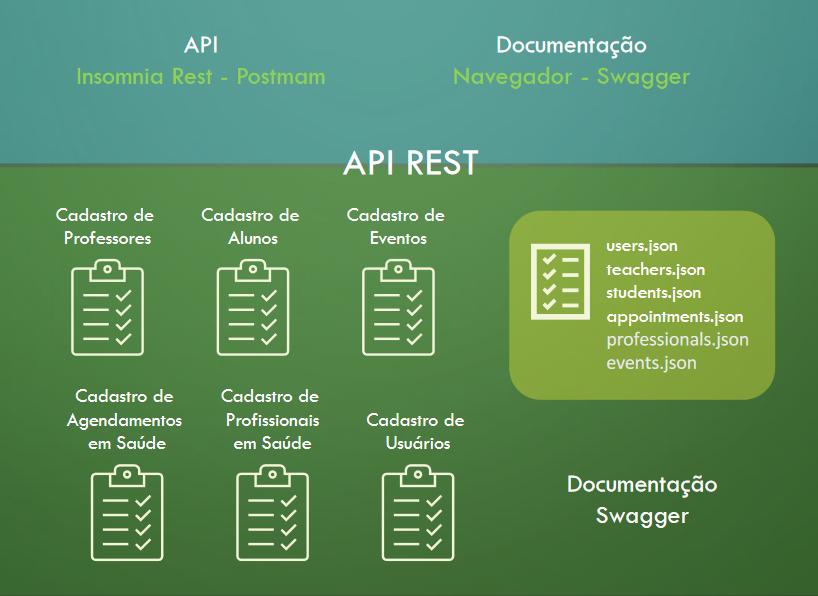

# API de Gestão Escolar

Implementar uma API "Gestão de Ensino Especial" e as funcionalidades aprendidas durante o curso!

Utilizar o seguinte mapa do projeto:

A API “Gestão de Ensino Especial” deve ter as funcionalidades CRUD
para cada entidade listada anteriormente:
- Create → Criar cadastros novos
- Read → Leitura de um cadastro
- Update → Alteração de cadastro
- Delete → Remoção de um cadastro

Além de possuir uma tabela em JSON e um arquivo de rota para cada
uma das entidades.
Também vai ser de extrema importância a documentação em formato
Swagger para cada uma das rotas das entidades.
Cada membro da equipe deverá criar as rotas e a documentação de
uma entidade.

## Métodos:
- GET: listar todos os registros;
- GET por ID / nome / data: busca por id, busca por nome e quando possível busca por data;
- UPDATE: atualizar um registro;
- POST: cadastrar um novo registro;
- DELETE: apagar um registro.

## TECNOLOGIAS A SEREM USADAS:
- Javascript
- Funções de array (array.map, array.filter, array.sort, ...)
- Fetch ou axios ou require;
- Node.js
- Express.js
- JSON
- Swagger
